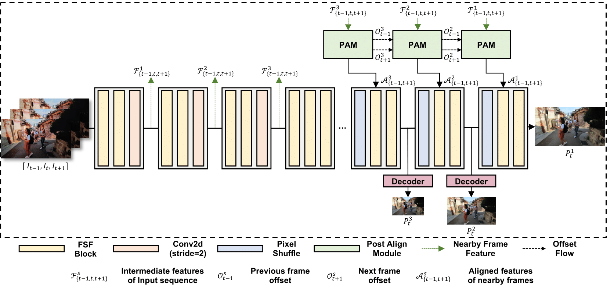
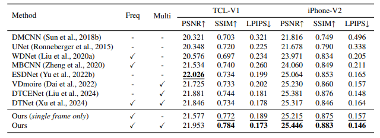
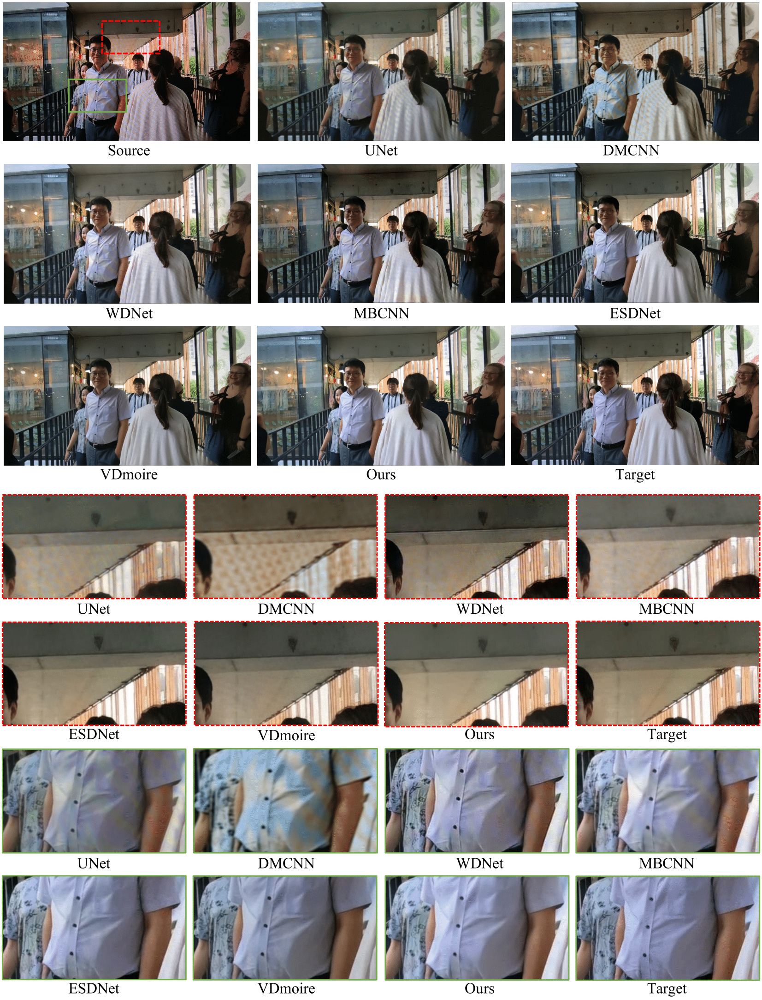
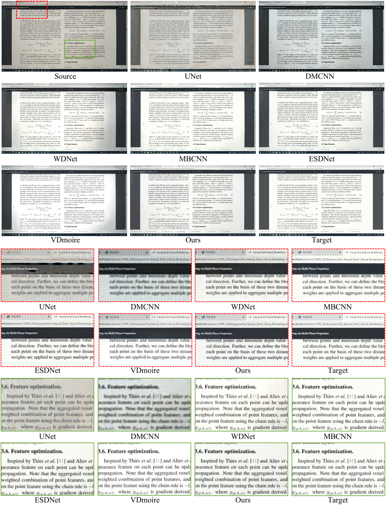

## FPANet: Frequency-based Video Demoireing using Frame-level Post Alignment

**Neural Networks 2025**

Gyeongrok Oh, Sungjune Kim, Heon Gu, Sang Ho Yoon, Jinkyu Kim*, Sangpil Kim* 

<a  href="https://arxiv.org/abs/2301.07330" rel="nofollow"></a>


This repository is the official implementation associated with the paper "FPANet: Frequency-based Video Demoireing using Frame-level Post Alignment". 


<a> </a> 
<a> </a>
<a> </a>


**Abstract: Moire patterns, created by the int erference between overlapping grid patterns in the pixel space, degrade the visual quality of images and videos. Therefore, removing such patterns (demoireing) is crucial, yet remains a challenge due to their complexities in sizes and distortions. Conventional methods mainly tackle this task by only exploiting the spatial domain of the input images, limiting their capabilities in removing large-scale moire patterns. Therefore, this work proposes FPANet, an image-video demoireing network that learns filters in both frequency and spatial domains, improving the restoration quality by removing various sizes of moire patterns. To further enhance, our model takes multiple consecutive frames, learning to extract frame-invariant content features and outputting better quality temporally consistent images. We demonstrate the effectiveness of our proposed method with a publicly available large-scale dataset, observing that ours outperforms the state-of-the-art approaches in terms of image and video quality metrics and visual experience.**



## Getting Started

### Setup
This implementation based on BasicSR which is a open source toolbox for image/video restoration tasks.

For all the methods described in the paper, is it required to have:
- Anaconda
- DCNv2
- Pytorch

Create the conda virtual environment:
```shell script
conda env create -f environment.yaml
conda activate fpanet
```
We use the DCNv2_latest repository to build and install the Deformable Convolution module.

Follow the steps below to set it up:
```shell script
# 1. Clone the DCNv2_latest repository
git clone https://github.com/lucasjinreal/DCNv2_latest

# 2. Navigate to the DCNv2_latest directory
cd FPANet/models/DCNv2_latest

# 3. Build and install the module
python setup.py install
```
```
FPANet/
├── DCNv2_latest/
| ...
```

### Dataset Preparation
To prepare the dataset for training and evaluation, follow these steps:
1. Download the VDMoire dataset from [VDMoire Datasets Link](https://github.com/CVMI-Lab/VideoDemoireing?tab=readme-ov-file).

2. Extract the downloaded dataset and place it in the `./datasets` directory. Your directory structure should look like this:

```
  FPANet/
  ├── datasets/
  │   ├── iphone/
  │   │   ├── train/
  │   │   ├── test/
  |   ├── tcl/
  │   │   ├── train/
  │   │   ├── test/
  └── ...
  ```

### Training.

To train own model, please use this following code:

```
python -m torch.distributed.launch --nproc_per_node=<NUM_GPUS> --master_port=4321 ./train.py -opt option/train/train_<tcl or iphone>.yml 
```

### Evalutaion.

To evaluate model, run the following code:

```
python3 -m torch.distributed.launch --nproc_per_node=<NUM_GPUS> --master_port=4321 ./test.py -opt option/test/test_<tcl or iphone>.yml 
```


### Quantitative Results
<details>
  <summary> <strong>Main table</strong> (click to expand) </summary>
<p align="center">  </p>
</details>
  

### Qaulitative Results
<details>
  <summary> <strong>TCL-V1</strong> (click to expand) </summary>
<p align="center">  </p>
</details>
<details>
  <summary> <strong>iPhone-V2</strong> (click to expand) </summary>
<p align="center">  </p>
</details>

## Citation
```
@article{oh2025fpanet,
  title={Fpanet: Frequency-based video demoireing using frame-level post alignment},
  author={Oh, Gyeongrok and Kim, Sungjune and Gu, Heon and Yoon, Sang Ho and Kim, Jinkyu and Kim, Sangpil},
  journal={Neural Networks},
  volume={184},
  pages={107021},
  year={2025},
  publisher={Elsevier}
}
```
